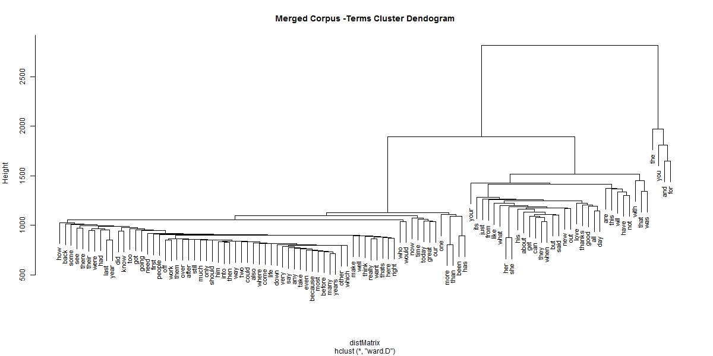

##Exploratory Data Analysis - Predictive Model for Text Mining

The goal of this paper is to explore the [HC Corpora](http://corpora.heliohost.org) data provided by Coursera and build a machine learning algorithm for text mining. 
These data contain news articles, blogs and twitter texts in various languages. For this paper we used news, blogs and twitter text messages provided in English only.
We used R programming language for our exploratory analysis. We loaded and reviewed these data extensively before building and applying the cleanup/transformation routines.
We generated preliminary data counts on the entire data set. We then built our training data using 70% each from news, blogs and twitter text so we can preserve variety of the data sources for our modeling.
We then generated few random samples from this training data for our analysis, which are explained below. We used tm, RWeka, slam packages in R to build few sample "corpuses" for our data exploration.  A corpus is a set of documents or individual sentences. We built unigrams, bigrams and trigrams on these samples to learn the word frequencies, their phrase frequencies and their associations. 


### Data Load

During the data load process we standardized the character set of these data to ASCII format and skipped any embedded nul characters, binary/unicode characters etc. We generated some preliminary data counts on the entire dataset as listed below.

```{r echo=FALSE}
suppressPackageStartupMessages(library(stringr))
suppressPackageStartupMessages(library(grid))
suppressPackageStartupMessages(library(tm))
suppressPackageStartupMessages(library(slam))
suppressPackageStartupMessages(library(RWeka))
suppressPackageStartupMessages(library(wordcloud))
suppressPackageStartupMessages(library(R.utils))
suppressPackageStartupMessages(library(stringr))
suppressPackageStartupMessages(library(data.table))
suppressPackageStartupMessages(library(reshape2))
suppressPackageStartupMessages(library(ggplot2))

load("./data/orig_datacounts.RData")

    nws_fsize<-round(nws_fsize,2)
    twts_fsize<-round(twts_fsize,2)
    blgs_fsize<-round(blgs_fsize,2)
    news_words<-nws_word_count
    twts_words<-twts_word_count
    blgs_words<-blgs_word_count
  
```


| HC Corpora Data filename |  File Size     |    Line Counts    |   Word Counts   |
|--------------------------|----------------|-------------------|-----------------|
| en_US.news.txt           | `r nws_fsize`  | `r nws_length`    | `r news_words`  |
| en_US.twitter.txt        | `r twts_fsize` | `r twts_length`   | `r twts_words`  |
| en_US.blogs.txt          | `r blgs_fsize` | `r blgs_length`   | `r blgs_words`  |

### Data Cleansing

Tidying up this dataset required us to understand the language constructs and its usage, so it was quite an interesting exercise. First we expanded english word contractions. We built several cleaning filters which include stripping extra white spaces at the beginning, middle and end of the sentences; removing any html links; removing strange foreign characters; remove punctuation and any line and/or word separators (hyphens, quotes , period, exclamation etc); we deleted emoji(emotional expressions) characters; numeric characters; remove any left over unicode/special characters etc. All the basic cleansing of these data was done using base R utilities.


### Training Data

**Training(70%), Test (15%) and Cross Validation(15%) Data**

We cleaned twitter, news and blogs dataset; took 70% of each of these data and merged them to build the training dataset. One half (15%) of the remaining cleaned dataset was set aside for testing and the other half (15%) was set aside for the cross validation of the model.

**Sample Data for this exploratory analysis** - For this analysis, we built few corpuses by random sampling.

* News Corpus -  20% of the training news data set. 
* Twitter Corpus - 20% of the training twitter data set. 
* Blogs Corpus -  20% of the training blogs data set. 
* Merged Corpus - 20% of the merged training data set.

### Build Sample Corpus - Tidy it up.

We built these sample corpus using R tm (text mining) package and explored them using RWeka and slam packages. We transformed all of the data into lower case and stripped any whitespaces in the corpus. We built document term matrix for each of the corpus to study their text. 

We observed that each of the corpus had about 5 percent of the words that were most frequent and rest were very sparse. This was true for all our samples and whole training data set. We removed these sparse terms to be a able to present meaningful analysis here.

We revised our corpus and the document term matrix to make our terms reasonably dense. We also compiled a list of bad words (profanity) some manually and some from the internet. These words will be excluded from further analysis here.


### Build Ngram Models

We used merged corpus and its document term matrix to create unigrams, bigrams and trigrams. 


**Most Frequent ngrams**


```{r echo=FALSE}
 
load("./data/exploratorysrcData.RData")

## Frequently used unigrams

uniplot<-ggplot(data=subset(uni_smpl, freq>7500),aes(word, freq))+
geom_bar(stat="identity")+
theme(axis.text.x=element_text(angle=45,hjust=1))+ coord_flip() +
ggtitle("Unigrams") +
  theme(plot.title = element_text(size = 9, face="bold"))


biplot<-ggplot(data=subset(bi_smpl, freq>2500),aes(word, freq))+
geom_bar(stat="identity")+
theme(axis.text.x=element_text(angle=45,hjust=1))+ coord_flip()+
ggtitle("Bigrams")+
  theme(plot.title = element_text(size = 9, face="bold"))


triplot<-ggplot(data=subset(tri_smpl, freq>400),aes(word, freq))+
geom_bar(stat="identity")+
theme(axis.text.x=element_text(angle=45,hjust=1))+ coord_flip()+
  ggtitle("Trigrams")+
  theme(plot.title = element_text(size = 9, face="bold"))


pushViewport(viewport(layout=grid.layout(1,3)))
print(uniplot, vp = viewport(layout.pos.row = 1, layout.pos.col = 1))
print(biplot, vp = viewport(layout.pos.row = 1, layout.pos.col = 2))
print(triplot, vp = viewport(layout.pos.row = 1, layout.pos.col = 3))

```

**Hierarchical Cluster - term associations**


```{r echo=FALSE}
#load("./data/exploratoryHCLUST.Rdata")
#plot(sample.fit,cex=0.9,main="Merged Corpus -Terms Cluster Dendogram")

```

The terms higher in the plot are the most frequent terms in the corpus, and the terms close to each other are more associated with each other.


**Bigram - wordcloud**
```{r echo=FALSE}
wordcloud(bi_smpl$word, bi_smpl$freq, min.freq=2000,,rot.per=0.2,scale=c(3, .1),  colors=brewer.pal(6, "Dark2"))
```

**Trigram - wordcloud**
```{r echo=FALSE}

wordcloud(tri_smpl$word, tri_smpl$freq, min.freq=600, scale=c(3, .1), colors=brewer.pal(6, "Dark2"))
```

**News, Blog and Twitter Texts Analysis**

As mentioned before we built separate corpus for each of the news, twitter and blogs training sample. The usage of words was quite different in these text documents as anticipated early on. Here is an interesting analysis that shows trigrams and their frequencies from each of the news, blogs and twitter corpus(s).

```{r echo=FALSE}
load("./data/exploratoryChartsData.RData")

library(ggplot2)
pt<- ggplot(data=t_trigrams[1:25,],aes(word, freq))+
  geom_bar(stat="identity")+coord_flip() +
  theme(axis.text.x=element_text(angle=45,hjust=1))+
  ggtitle("Twitter Trigrams")+
  theme(plot.title = element_text(size = 9, face="bold"))
 

pb<-ggplot(data=b_trigrams[1:25,],aes(word, freq))+
geom_bar(stat="identity")+coord_flip() +
theme(axis.text.x=element_text(angle=45,hjust=1))+
  ggtitle("Blogs Trigrams")+
  theme(plot.title = element_text(size = 9, face="bold"))


pn<-ggplot(data=n_trigrams[1:25,],aes(word, freq))+
geom_bar(stat="identity")+coord_flip() +
theme(axis.text.x=element_text(angle=45,hjust=1))+
  ggtitle("News Trigrams")+
  theme(plot.title = element_text(size = 9, face="bold"))

pushViewport(viewport(layout=grid.layout(1,3)))
print(pt, vp = viewport(layout.pos.row = 1, layout.pos.col = 1))
print(pb, vp = viewport(layout.pos.row = 1, layout.pos.col = 2))
print(pn, vp = viewport(layout.pos.row = 1, layout.pos.col = 3))

```

**Text Coverage**

A review of all unigrams to see how many terms are needed to provide maximum coverage.


```{r echo=FALSE}
load("./data/exploratoryCoveragePlot.Rdata")
options(scipen = 50)

plot(cumsum(src_ugrams$freq)/sum(src_ugrams$freq),type="l",col="blue",
     xlab="Word(s)",
     ylab="Word Percentage")
lines(cumsum(b_unigrams$freq)/sum(b_unigrams$freq),type="l",col="red")
lines(cumsum(n_unigrams$freq)/sum(n_unigrams$freq),type="l",col="green")
lines(cumsum(t_unigrams$freq)/sum(t_unigrams$freq),type="l",col="yellow")
legend("bottomright",legend = c("merged","blogs","news","twitter"),
       col=c("blue","red","green","yellow"),lwd=2)
```

As can be seen above  all of the data sources have about 5000 to 7000 words that provided upto 80% of text coverage for the language used. Hopefully by using Markovs chained grams, Katz Backoff model and smoothing we will be able to increase the text coverage in our prediction model.
       
#### Plan for building prediction algorithm and Shiny app
* To gain performance speeds will switch back to R base utilities to generate n-grams.
* We will generate unigrams, bigrams, trigrams and quadgrams; and include word frequencies and their maximum likelihood estimates for probability. 
* Our goal is to build these ngrams and filter them intelligently so they are compact and can be loaded easily onto Shiny server with resource restrictions.
* Implement Katz Backoff model for prediction - basicaly use a quadgram if matched; otherwise use a trigram; otherwise bigram; otherwise unigram.
* Build a backoff smoothing, by holding least frequently seen words out and discounting their maximum likelihood estimates to compute maximum likelihood estimates for unseen words.
* Train this model on training data
* Test this model using test data
* Build some kind of hypothesis testing for the model.
* Build a shiny app that can predict three words 

